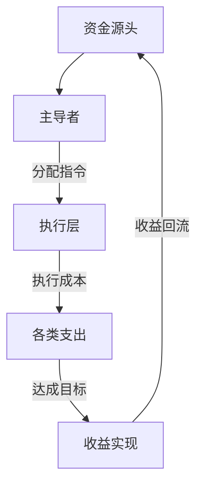

# PX-01: 资金流假设与估算模型

## 1. 总体资金流假设图


## 2. 分项成本收益估算表
| 环节 | 假设项目 | 估算方法 | 估算值 | 可信度 | 数据来源 |
| :--- | :--- | :--- | :--- | :--- | :--- |
| **资金源头** | 初始资金池 | 类比已知案例 | 100,000元 | 低 | 推测 |
| **执行成本** | 雇佣1人/天 | 本地劳动力日薪 | 200元 | 高 | 可调研 |
| **执行成本** | 设备成本 | 电商平台搜索 | 3000元 | 高 | 可验证 |
| **潜在收益** | ... | ... | ... | ... | ... |

## 3. 财务可持续性分析
-   **总成本估算**: `sum(执行成本)` = 
-   **总收益估算**: `sum(潜在收益)` = 
-   **盈亏平衡点**: 该操作需要持续多久/多大范围才能回本？
-   **结论**: 基于当前估算，该模型在财务上是否可持续？ **是 / 否 / 不确定**


```

### 如何获得复利效应？

1.  **模板化**：将以上三个模板存入 `Templates/` 文件夹。
2.  **联动**：在 `每周复盘` 中，加入“财务回顾”环节，查看个人和项目的资金流情况。
3.  **迁移**：用这套方法去分析任何你感兴趣的公司、行业或现象，锻炼你的商业嗅觉。

这套系统不仅能让你管好自己的钱，更能让你**看透世界上任何商业模式的本质**。这才是真正的复利能力。