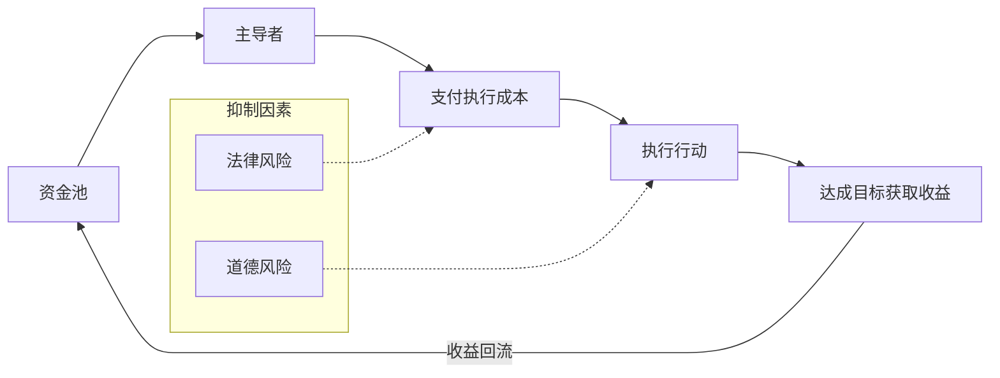

# PX-01 - 系统动力学分析

## 反馈回路图

## 回路分析
-   **增强回路（放大过程）**：`资金 -> 行动 -> 收益 -> 更多资金` 这是一个正反馈？
-   **调节回路（抑制过程）**：`法律风险 -> 增加成本/减少执行` 这是一个负反馈？
-   **延迟在哪里？** 哪个环节的延迟会导致系统失控？

## 系统洞察
-   系统的**杠杆点**在哪里？（改变哪里能用最小努力获得最大变化？
-   系统最终会走向增长、崩溃还是稳定？

