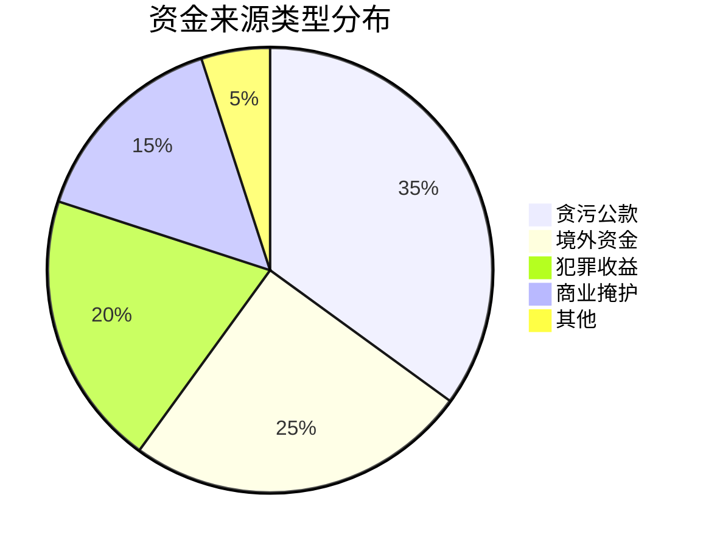

# 📊 资金流分析引擎

## 🎯 分析框架

### 框架1：资金流转网络分析
```python
# 资金网络分析模型
def analyze_fund_network(transactions, entities, timelines):
    """
    输入：交易记录、实体信息、时间线
    输出：关键节点、薄弱环节、阻断策略
    可迁移：任何资金网络分析
    """
    return network_analysis
```

### 框架2：洗钱手法分类
| 洗钱手法 | 使用频率 | 隐蔽性 | 金额限制 | 打击难度 |
|----------|----------|--------|----------|----------|
| 地下钱庄 | 高 | 中 | 无限制 | 🔴🔴🔴 |
| 虚拟货币 | 中 | 高 | 无限制 | 🔴🔴🔴🔴 |
| 现金交易 | 高 | 低 | 物理限制 | 🔴🔴 |
| 贸易洗钱 | 中 | 高 | 无限制 | 🔴🔴🔴🔴 |
| 空壳公司 | 高 | 中 | 无限制 | 🔴🔴🔴 |

## 📈 关键资金洞察

### 1. 资金来源占比


### 2. 资金流转关键节点

**关键点**：地下钱庄、现金提取节点

## 🚀 分析应用输出

### 立即应用
- [ ] 资金流监控重点清单
- [ ] 关键节点打击优先级
- [ ] 资金阻断策略方案

### 长期价值
- [ ] 资金流预警系统
- [ ] 洗钱手法识别库
- [ ] 自动化监控平台

---
*分析应用：[[💡-洞察发现]] → [[✅-结论报告]]*