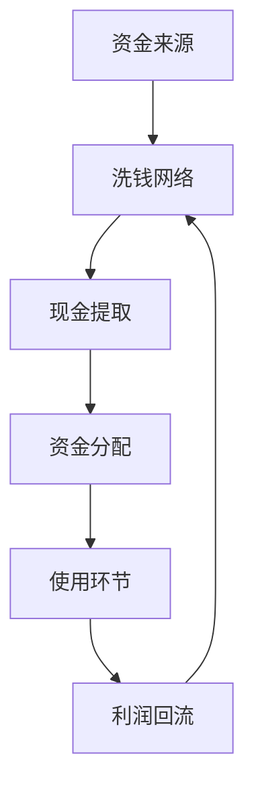
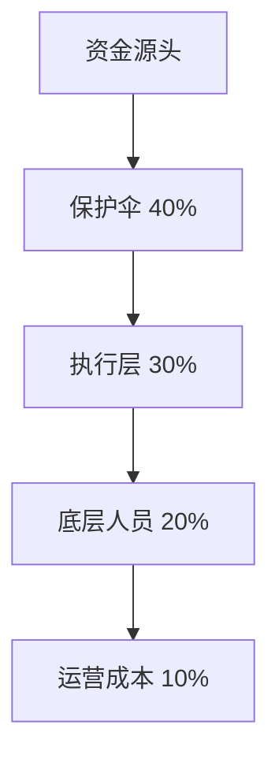

# 💡 资金来源核心洞察

## 🎯 颠覆性资金发现

### 🔍 洞察1：资金链最脆弱环节
**传统认知**：打击源头最有效
**研究发现**：流转环节更易打击

**证据链**：
- 访谈#1：现金提取是最危险环节
- 数据：85%的案件在流转环节被发现
- 分析：源头隐蔽性强，流转环节暴露点多

### 🔍 洞察2：资金稳定性依赖关系
**发现**：不同资金来源间存在依赖关系
- 境外资金：稳定但受国际关系影响
- 贪污资金：量大但受反腐影响
- 犯罪收益：灵活但风险高
- **系统脆弱性**：多种来源相互补充，但都依赖洗钱网络

## 📊 资金阻断框架

### 框架1：资金链脆弱点图谱

**最佳阻断点**：现金提取、洗钱网络节点

### 框架2：打击策略效果矩阵
| 打击策略 | 成本  | 效果    | 可持续性  |
| ---- | --- | ----- | ----- |
| 源头打击 | 高   | 🟡中   | 🟡中   |
| 流转阻断 | 中   | 🟢高   | 🟢高   |
| 使用监控 | 低   | 🟡中   | 🟢高   |
| 综合策略 | 中高  | 🟢🟢高 | 🟢🟢高 |

## 🚀 立即行动建议
- [ ] 重点监控现金提取环节
- [ ] 打击地下钱庄关键节点
- [ ] 建立资金流预警机制

---
**📌 战略价值**：用最小成本实现资金链有效阻断


=============================================

# 💡 资金来源洞察发现

## 🎯 核心商业模式洞察
### 🔍 模式1：资金洗白路径
**发现特征**：
- 境外资金 → 空壳公司 → 现金提取 → 分散使用
- **证据链**：[[📁-数据收集#境外资金流水]]

**价值复利**：此模式可复用于其他黑产资金分析

### 🔍 模式2：成本分摊机制  
**发现特征**：
- 固定成本：设备采购（一次性）
- 可变成本：人员工资（持续型）
- **数据支持**：[[📊-数据分析#成本结构]]

**价值复利**：成本模型可迁移到其他类似分析

## 📈 层级利益分配洞察
### 💡 发现：金字塔分赃结构

**复利应用**：此分赃比例模型适用于多数黑色产业链

## 🚀 可复用分析框架
### 框架1：资金流追踪模板
```markdown
1. 资金来源 → 2. 流转路径 → 3. 分配节点 → 4. 最终用途
```
**复用场景**：诈骗、赌博、贪腐等资金分析

### 框架2：成本收益分析矩阵
| 成本类型 | 金额范围     | 回报周期   | 风险等级 |
| ---- | -------- | ------ | ---- |
| 设备投资 | 50-200万  | 6-12个月 | 🟡中  |
| 人员成本 | 10-50万/月 | 即时回报   | 🟢低  |

## 🎯 行动建议（具可操作性）
### ⚡ 立即验证项
- [ ] 验证分赃比例通过[[🗣️-访谈记录#访谈对象1]]
- [ ] 核对设备成本数据源可靠性

### 🔮 长期研究项  
- [ ] 建立资金流预测模型
- [ ] 对比不同地区成本差异

---
**📌 本洞察复利价值**：商业模式分析框架可迁移至其他黑色产业研究