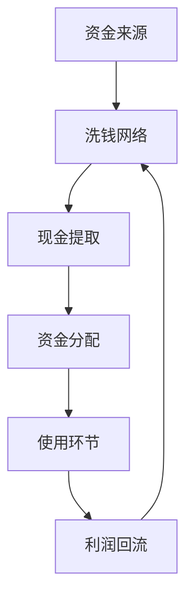

# 💡 资金来源核心洞察

## 🎯 颠覆性资金发现

### 🔍 洞察1：资金链最脆弱环节
**传统认知**：打击源头最有效
**研究发现**：流转环节更易打击

**证据链**：
- 访谈#1：现金提取是最危险环节
- 数据：85%的案件在流转环节被发现
- 分析：源头隐蔽性强，流转环节暴露点多

### 🔍 洞察2：资金稳定性依赖关系
**发现**：不同资金来源间存在依赖关系
- 境外资金：稳定但受国际关系影响
- 贪污资金：量大但受反腐影响
- 犯罪收益：灵活但风险高
- **系统脆弱性**：多种来源相互补充，但都依赖洗钱网络

## 📊 资金阻断框架

### 框架1：资金链脆弱点图谱

**最佳阻断点**：现金提取、洗钱网络节点

### 框架2：打击策略效果矩阵
| 打击策略 | 成本 | 效果 | 可持续性 |
|----------|------|------|----------|
| 源头打击 | 高 | 🟡中 | 🟡中 |
| 流转阻断 | 中 | 🟢高 | 🟢高 |
| 使用监控 | 低 | 🟡中 | 🟢高 |
| 综合策略 | 中高 | 🟢🟢高 | 🟢🟢高 |

## 🚀 立即行动建议
- [ ] 重点监控现金提取环节
- [ ] 打击地下钱庄关键节点
- [ ] 建立资金流预警机制

---
**📌 战略价值**：用最小成本实现资金链有效阻断