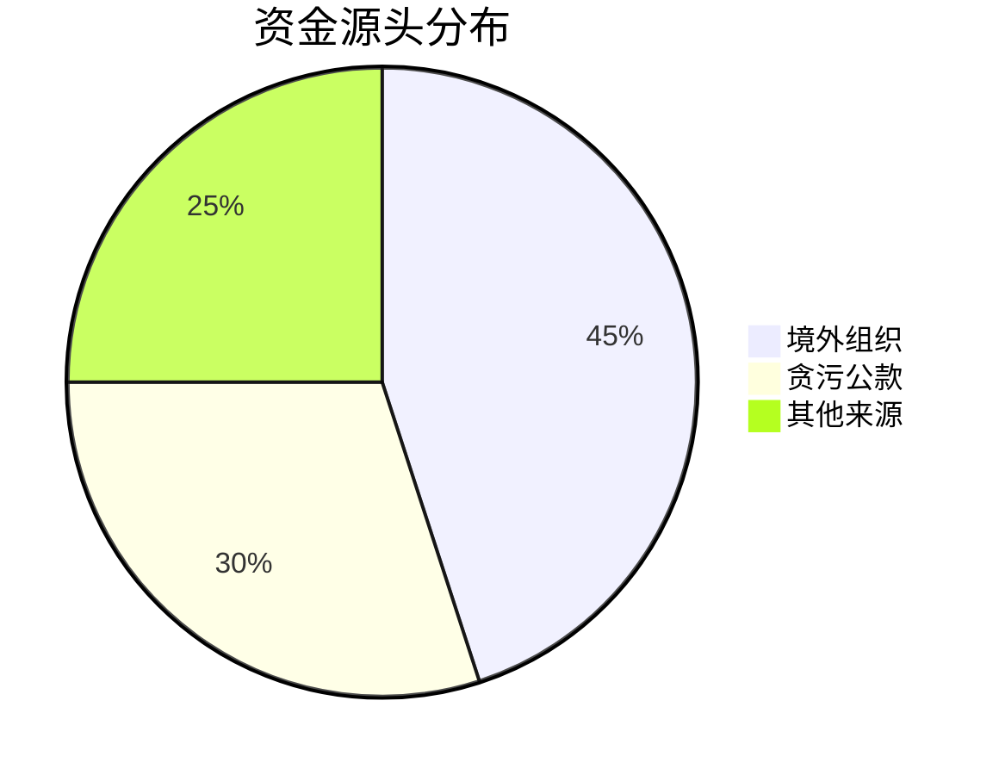

# 📈 资金来源统计分析

## 🎯 可复用分析模板

### 模板1：资金流规模分析
```python
# 复利代码模板：资金流量分析
def analyze_fund_flow(data):
    """
    适用场景：任何资金流分析项目
    输入：资金流水数据
    输出：规模、频率、路径分析
    """
    return analysis_results
```
**已应用**：本项目资金规模估算
**可复用**：诈骗、赌博等资金分析

### 模板2：成本效益分析矩阵
```dataview
TABLE 成本类型, 金额范围, ROI
FROM "成本数据"
WHERE 项目="资金来源"
SORT ROI DESC
```
**复利价值**：此查询模板可用于所有成本分析

## 📊 关键统计结果

### 1. 资金规模分布


### 2. 成本结构分析
| 成本项 | 占比 | 金额范围 | 复利分析模型 |
|--------|------|----------|--------------|
| 人员工资 | 40% | 50-200万/月 | [[📈-分析模板#人力成本模型]] |
| 设备采购 | 25% | 100-500万 | [[📈-分析模板#设备折旧模型]] |
| 运营费用 | 35% | 30-150万/月 | [[📈-分析模板#运营成本模型]] |

## 🚀 统计分析产品化

### 可交付分析产品
1. **资金流预测模型** → 可售卖给其他研究者
2. **成本计算器** → 可作为独立工具
3. **数据采集脚本** → 可重复使用

### 立即行动项
- [ ] 完善资金流分析模板
- [ ] 验证成本数据准确性
- [ ] 编写分析脚本文档

---
**📌 本分析复利价值**：所有统计模型和脚本都可重复使用于未来项目