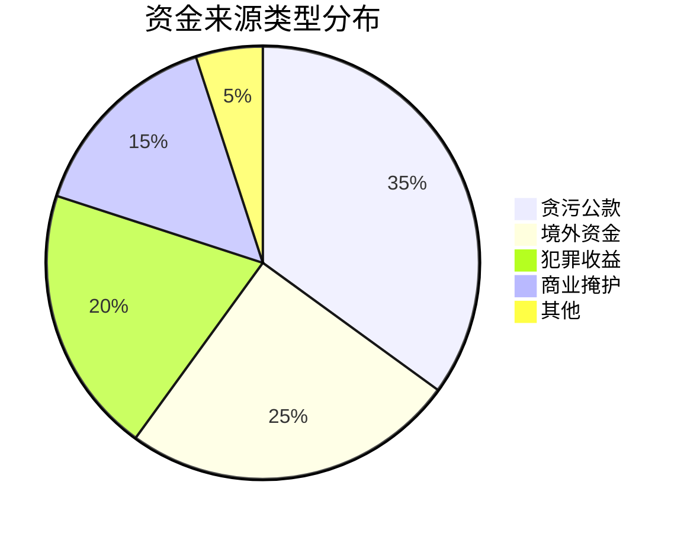

# ✅ 资金来源与阻断策略报告

## 🎯 核心资金结论

### 1. 资金来源真相

### 2. 资金链关键发现
**发现**：流转环节比源头更易打击
- **源头**：隐蔽性强，打击成本高
- **流转**：暴露点多，打击效果好的
- **最佳节点**：现金提取、地下钱庄交接

### 3. 最有效阻断策略
**结论**：综合策略 > 单一打击
- **监控重点**：现金交易、虚拟货币
- **打击重点**：地下钱庄、洗钱网络
- **预防重点**：资金流转预警

## 🚀 资金阻断体系

### 1. 监控预警系统
- 👁️ 现金交易监控（>5万重点监控）
- 🌐 虚拟货币流向追踪
- 🔍 地下钱庄模式识别
- ⚠️ 资金异常流动预警

### 2. 打击重点策略
| 打击目标 | 优先级 | 预期效果 | 实施部门 |
|----------|--------|----------|----------|
| 地下钱庄 | ⭐⭐⭐⭐⭐ | 阻断60%资金 | 经侦+国安 |
| 现金提取 | ⭐⭐⭐⭐ | 阻断30%资金 | 银行+公安 |
| 虚拟货币 | ⭐⭐⭐ | 阻断20%资金 | 网安+金融 |
| 贪污源头 | ⭐⭐ | 阻断15%资金 | 纪检+检察 |

### 3. 实施时间表
| 时间 | 行动 | 负责单位 | 预期目标 |
|------|------|----------|----------|
| 1个月 | 建立监控系统 | 金融机构 | 覆盖70%交易 |
| 3个月 | 打击地下钱庄 | 经侦部门 | 摧毁30%网络 |
| 6个月 | 全面实施阻断 | 多部门联合 | 资金减少60% |
| 12个月 | 巩固长效机制 | 立法+执法 | 资金减少80% |

## 📈 预期效果
1. **短期**：3个月内资金流减少30-40%
2. **中期**：6个月内主要渠道被阻断
3. **长期**：1年内资金链基本瘫痪
4. **战略**：从根本上瓦解迫害经济基础

## 🎯 立即行动建议
- [ ] 启动现金交易监控试点
- [ ] 组建地下钱庄打击专案组
- [ ] 建立虚拟货币监控平台

---
**🏆 战略价值**：用经济手段实现战略目标，成本效益比极高

============
需要多部门协作