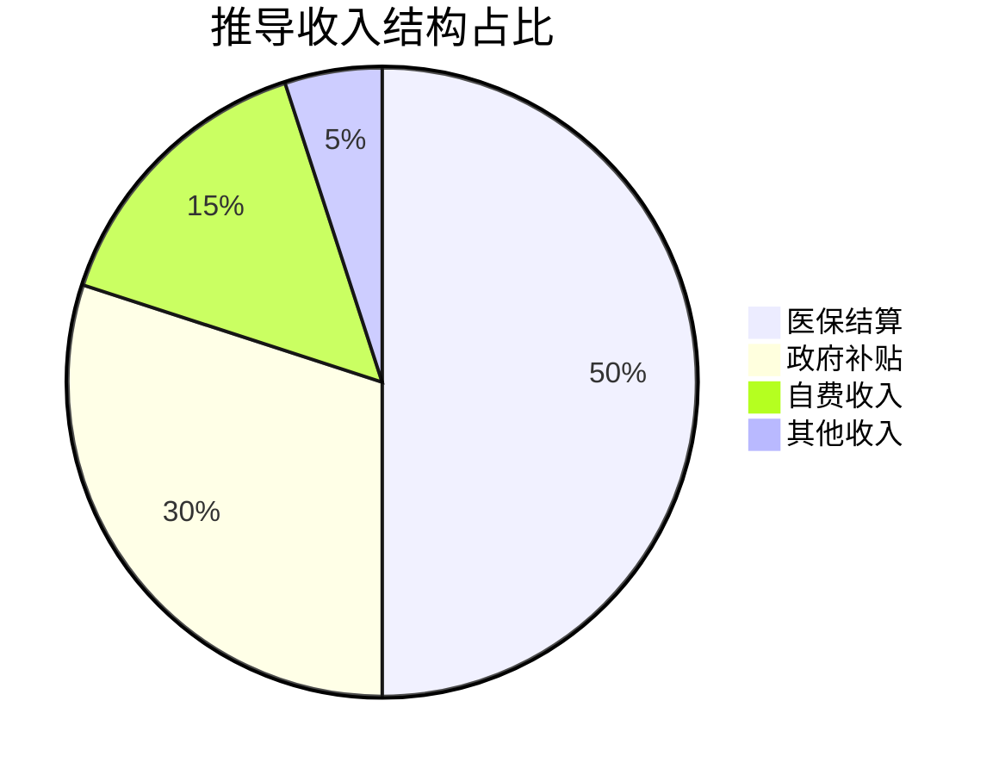
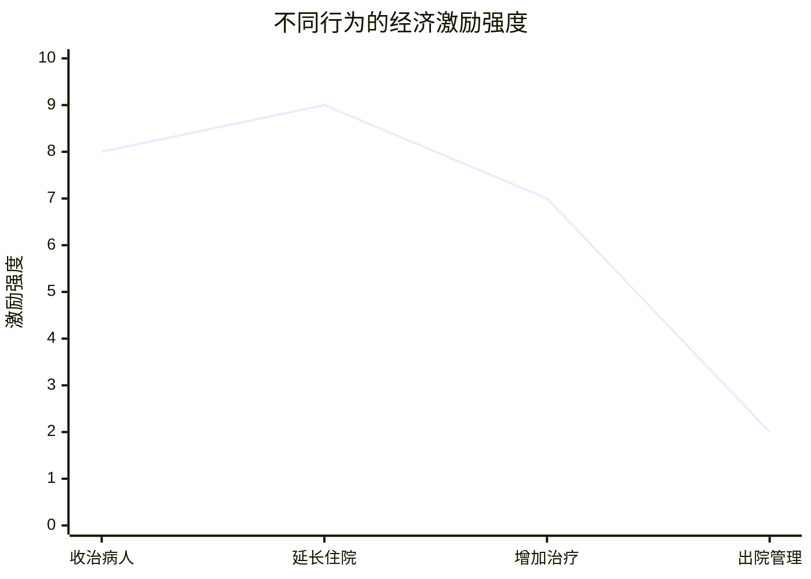

# 📊 利益链经济分析引擎

## 🎯 分析框架

### 框架1：经济激励扭曲模型
```python
# 激励扭曲分析模型
def analyze_incentive_distortion(intended_incentives, actual_behavior, regulatory_gaps):
    """
    输入：设计意图、实际行为、监管漏洞
    输出：扭曲程度、风险点、修正建议
    可迁移：任何政策效果分析
    """
    return distortion_analysis
```

### 框架2：利益分配推导矩阵
| 相关方 | 可能收益 | 收益形式 | 风险承担 |
|----------|----------|----------|----------|
| 精神病院 | 经济收入 | 补贴+医保+自费 | 法律风险 |
| 医生 | 绩效收入 | 奖金+提成 | 职业风险 |
| 送治方 | 问题解决 | 麻烦消除+可能经济利益 | 法律风险 |
| 中间人 | 中介费用 | 现金回报 | 法律风险 |

## 📈 关键经济洞察

### 1. 收入结构推导


### 2. 经济激励强度

**推导结论**：延长住院和增加收治激励最强

## 🚀 分析应用输出

### 立即应用
- [ ] 经济风险预警指标
- [ ] 监督重点清单
- [ ] 防范滥用策略

### 长期价值
- [ ] 医疗机构经济分析框架
- [ ] 政策设计评估能力
- [ ] 经济思维提升路径

---
*分析应用：[[💡-洞察发现]] → [[✅-结论报告]]*