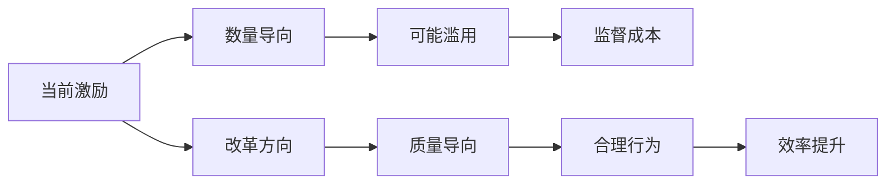

# 💡 利益链经济机制洞察

## 🎯 关键经济发现

### 🔍 洞察1：补贴政策的非预期后果
**政策意图**：保障精神病人医疗需求
**实际效果**：可能创造经济激励扭曲

**推导证据**：
- 按床位补贴→鼓励多设床位
- 按病人补贴→鼓励多收病人  
- 按项目付费→鼓励多开治疗
- **综合效应**：经济激励指向数量而非质量

### 🔍 洞察2：多重委托代理问题
**发现**：存在复杂的委托代理关系
- 政府→医院：委托提供公共服务
- 医保→医院：委托合理使用资金
- 患者→医生：委托专业诊疗服务
- **代理问题**：各方利益不一致，信息不对称

## 📊 经济制衡框架

### 框架1：激励重构方案

### 框架2：监督制衡机制
| 监督方式 | 成本 | 效果 | 实施难度 |
|----------|------|------|----------|
| 政府监管 | 高 | 🟡中 | 🔴🔴高 |
| 医保审核 | 中 | 🟢高 | 🔴🔴中 |
| 同行评议 | 低 | 🟡中 | 🔴中 |
| 患者参与 | 低 | 🟢高 | 🔴🔴🔴高 |

## 🚀 推导应用方向

### 立即应用
- [ ] 设计激励优化方案
- [ ] 完善监督制衡机制
- [ ] 提升经济分析能力

### 长期价值
- [ ] 医疗机构治理框架
- [ ] 政策设计评估工具
- [ ] 系统思维训练材料

---
**📌 推导价值**：从经济角度理解复杂现象，提升逻辑推理能力