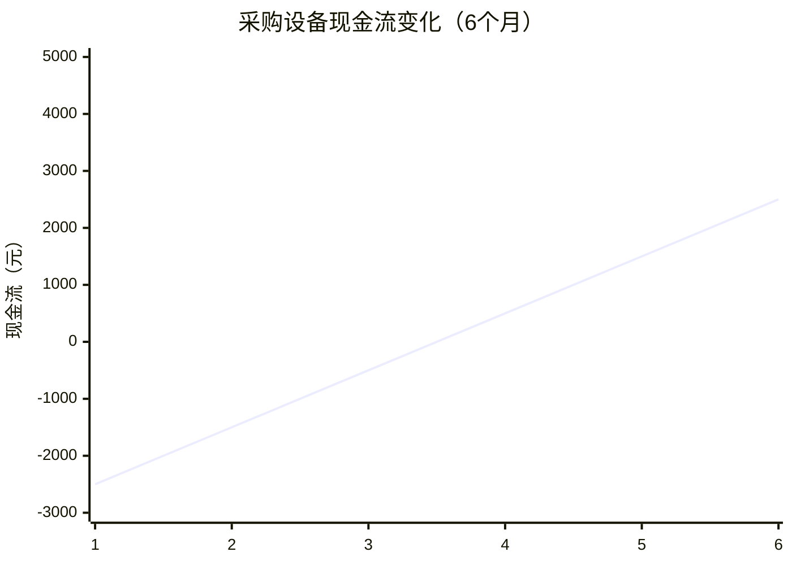
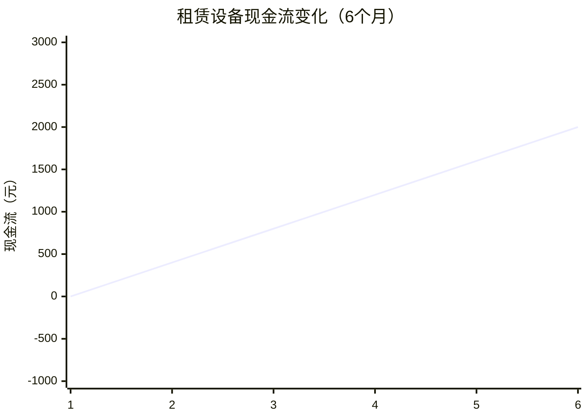

# 📁 设备成本盈利数据库

## 🎯 高价值设备ROI矩阵
| 设备类型 | 采购价 | 月租赁价 | 使用寿命 | 月收益 | ROI | 赚钱指数 |
|----------|--------|----------|----------|--------|-----|----------|
| 迷你监听器 | 800元 | 200元/月 | 12个月 | 500元/月 | 625% | 💰💰💰💰 |
| GPS定位器 | 300元 | 100元/月 | 8个月 | 300元/月 | 900% | 💰💰💰💰💰 |
| 隐蔽摄像头 | 1200元 | 300元/月 | 18个月 | 600元/月 | 500% | 💰💰💰 |
| 信号干扰器 | 2000元 | 400元/月 | 24个月 | 800元/月 | 400% | 💰💰 |

## 🔍 商业模式成本对比
### 采购模式现金流


### 租赁模式现金流


## 📊 套利机会发现
### 二手设备价差
| 设备类型 | 新机价格 | 二手价格 | 价差率 | 套利空间 |
|----------|----------|----------|--------|----------|
| 监听器 | 800元 | 350元 | 56% | 450元/台 |
| 定位器 | 300元 | 120元 | 60% | 180元/台 |
| 摄像头 | 1200元 | 550元 | 54% | 650元/台 |

## 🚀 数据采集策略
### 立即执行
- [ ] 验证二手设备市场价格（实地调查）
- [ ] 采集设备维修保养成本
- [ ] 记录设备实际使用寿命数据

### 赚钱工具开发
```python
# 设备ROI计算器（可产品化）
def calculate_roi(device_type, purchase_price, monthly_income):
    """