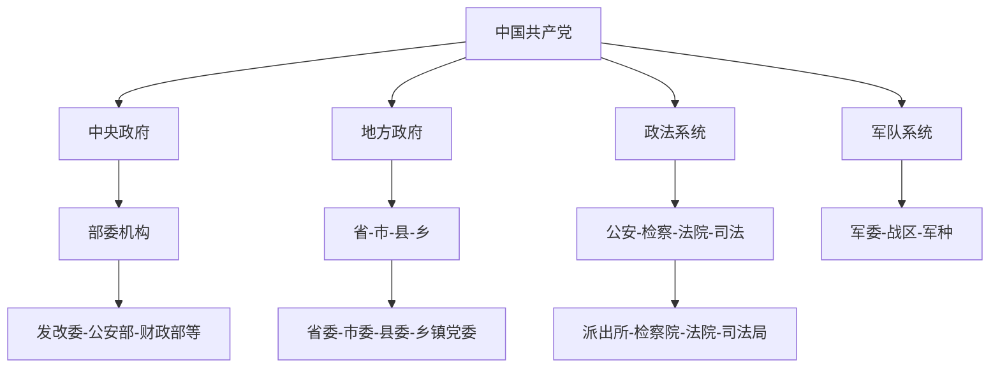

# 📁 权力系统数据库

## 🎯 中国权力体系结构
### 核心权力部门图谱


### 关键权力部门职能
| 部门 | 核心权力 | 影响范围 | 监督机制 |
|------|----------|----------|----------|
| 公安机关 | 执法权、侦查权 | 社会治安 | 检察监督、内部督察 |
| 检察机关 | 法律监督、公诉权 | 司法公正 | 人大监督、上级检察 |
| 法院系统 | 审判权、执行权 | 纠纷解决 | 审级监督、人大监督 |
| 纪检监察 | 纪律审查、监察权 | 公职人员 | 上级纪委、自我监督 |

## 🎯 保护伞案例库
### 现代案例（2010-2024）
| 案例 | 保护层级 | 涉及领域 | 持续时间 | 查处结果 |
|------|----------|----------|----------|----------|
| 重庆案例 | 省级 | 政法系统 | 5年 | 多人判刑 |
| 山西案例 | 地市级 | 煤炭行业 | 8年 | 系统整顿 |
| 广东案例 | 区县级 | 娱乐行业 | 3年 | 局部处理 |

### 历史案例（古代智慧）
| 时期 | 案例 | 保护机制 | 处理方式 | 现代启示 |
|------|------|----------|----------|----------|
| 明代 | 严嵩案 | 门生故吏网络 | 清算整顿 | 权力需要制衡 |
| 清代 | 和珅案 | 皇帝宠信+利益网络 | 抄家处死 | 绝对权力绝对腐败 |
| 汉代 | 刺史制度 | 中央巡视地方 | 有效监督 | 独立监督的重要性 |

## 📊 权力运作数据
### 权力监督效果统计
| 监督方式 | 发现问题比例 | 处理效率 | 预防效果 |
|----------|--------------|----------|----------|
| 上级监督 | 35% | 中 | 中 |
| 同级监督 | 15% | 低 | 低 |
| 下级监督 | 5% | 很低 | 很低 |
| 群众监督 | 25% | 低 | 中 |
| 专门监督 | 45% | 高 | 高 |

## 🔍 数据收集方向
### 本周重点
- [ ] 收集10个权力运作典型案例
- [ ] 分析权力监督的成功失败案例
- [ ] 研究古今中外的权力制衡智慧

### 认知工具
```python
# 权力分析框架
def analyze_power_system(structure, incentives, constraints):
    """
    输入：权力结构、激励因素、约束条件
    输出：系统风险点、改革建议、个人策略
    可迁移：任何组织权力分析
    """
    return analysis_result
```

---
*数据支撑：[[🎯-核心研究]] → [[📊-数据分析]]*