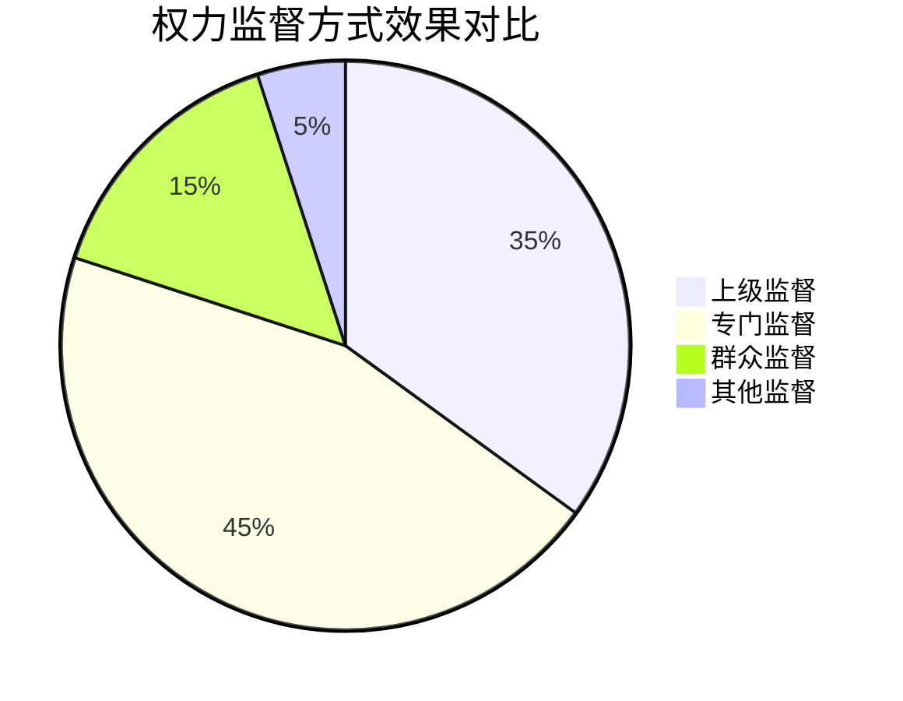

# 📊 权力系统分析引擎

## 🎯 分析框架

### 框架1：权力制衡系统分析
```python
# 权力制衡分析模型
def analyze_checks_balances(power_structure, oversight_mechanisms, incentive_system):
    """
    输入：权力结构、监督机制、激励体系
    输出：制衡效果、风险点、改进建议
    可迁移：任何组织分析
    """
    return analysis_result
```

### 框架2：保护伞形成条件矩阵
| 形成条件 | 影响程度 | 可预防性 | 案例证据 |
|----------|----------|----------|----------|
| 权力集中 | 🔴🔴🔴🔴🔴 | 中 | 多数案例 |
| 监督缺失 | 🔴🔴🔴🔴 | 高 | 所有案例 |
| 利益驱动 | 🔴🔴🔴🔴🔴 | 中 | 所有案例 |
| 文化因素 | 🔴🔴🔴 | 低 | 部分案例 |
| 个人道德 | 🔴🔴 | 低 | 个别案例 |

## 📈 关键系统洞察

### 1. 权力监督效果


### 2. 保护伞形成路径

**关键点**：多个条件同时具备才会形成

## 🚀 认知升级输出

### 立即应用
- [ ] 权力系统认知图谱
- [ ] 保护伞风险预警指标
- [ ] 个人生存发展策略指南

### 长期价值
- [ ] 组织权力分析框架
- [ ] 系统风险识别能力
- [ ] 复杂问题分析思维

---
*分析应用：[[💡-洞察发现]] → [[✅-结论报告]]*