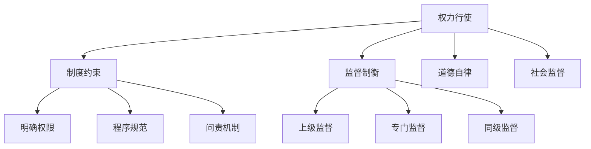

# 💡 权力系统本质洞察

## 🎯 颠覆性系统发现

### 🔍 洞察1：保护伞是系统性现象
**传统认知**：个人道德败坏
**深层本质**：系统设计缺陷+人性弱点

**证据链**：
- 访谈#1：系统性问题而非个人问题
- 历史案例：各朝代都有类似现象
- 国际比较：不同制度下都存在

**认知升级**：从道德批判转向系统理解

### 🔍 洞察2：权力制衡的古今智慧
**发现**：中国古代有丰富权力制衡智慧
- **唐代**：三省六部制（决策-审核-执行分离）
- **宋代**：台谏制度（独立言官监督）
- **明代**：厂卫制度（但缺乏有效制约）
- **现代**：党内监督+群众监督+司法监督

## 📊 系统优化框架

### 框架1：权力制衡多层次系统

### 框架2：个人系统生存策略
| 策略类型 | 具体方法      | 适用场景  | 风险控制 |
| ---- | --------- | ----- | ---- |
| 制度内  | 依法办事、程序正义 | 日常工作中 | 中    |
| 技巧性  | 请示汇报、留痕管理 | 模糊地带  | 低    |
| 防御性  | 保持距离、避免牵连 | 高风险环境 | 高    |
| 进取性  | 推动改革、建立新规 | 有利时机  | 中高   |

## 🚀 认知升级路径

### 立即应用
- [ ] 建立权力系统分析思维
- [ ] 学习古今制衡智慧
- [ ] 制定个人系统生存策略

### 长期价值
- [ ] 提升系统思考能力
- [ ] 增强社会复杂性理解
- [ ] 培养历史纵深视野

---
**📌 认知价值**：从现象观察到本质把握，从道德评判到系统理解