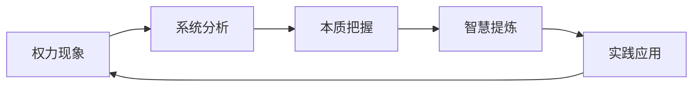

==================
# ✅ 权力系统认知升级报告

## 🎯 核心认知结论

### 1. 系统本质理解

### 2. 多维认知框架
**发现**：需要多层次、多角度理解权力现象
- **历史维度**：古今智慧对比借鉴
- **系统维度**：制度-文化-个人互动
- **实践维度**：理想与现实平衡
- **发展维度**：改革与稳定兼顾

### 3. 认知升级路径
**结论**：从简单到复杂，从表象到本质
- **第一阶段**：了解权力系统基本结构
- **第二阶段**：理解权力运作内在逻辑
- **第三阶段**：掌握权力分析思维方法
- **第四阶段**：应用智慧解决实际问题

## 🚀 认知升级体系

### 1. 知识体系构建
- 📚 **历史智慧**：中外权力制衡经验
- 🏛️ **系统知识**：权力结构运作原理
- 🧠 **分析方法**：多维度系统思考
- 💡 **实践智慧**：现实问题解决策略

### 2. 思维技能提升
| 思维能力 | 提升方法 | 应用场景 |
|----------|----------|----------|
| 系统思考 | 学习系统理论 | 复杂问题分析 |
| 历史思维 | 研究历史案例 | 规律趋势把握 |
| 辩证思维 | 多角度分析 | 避免片面极端 |
| 实践智慧 | 理论联系实际 | 现实问题解决 |

### 3. 个人成长路径
**短期**（1-3个月）：
- 掌握权力系统基本知识
- 建立系统分析思维框架

**中期**（3-12个月）：
- 深度研究历史典型案例
- 培养多维度思考能力

**长期**（1-3年）：
- 形成个人认知体系
- 应用智慧解决实际问题

## 📈 预期认知收获
1. **深度理解**：把握权力现象的本质规律
2. **系统思维**：建立多维度分析框架
3. **历史智慧**：借鉴古今中的经验教训
4. **实践能力**：提升现实问题解决水平

## 🎯 立即行动建议
- [ ] 开始系统学习权力制衡理论
- [ ] 研究3个历史典型案例
- [ ] 应用系统思维分析现实问题
- [ ] 建立个人认知升级笔记系统

---
**🏆 认知价值**：建立深度思考能力，提升社会复杂性理解水平