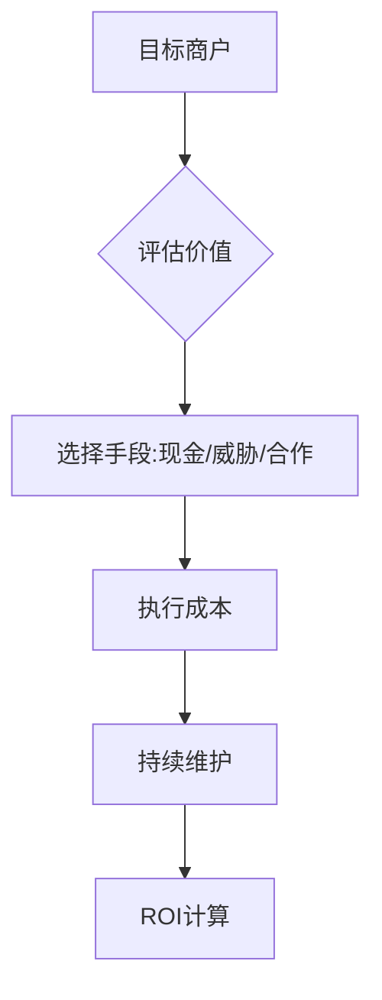

数据支撑: [[📁-数据收集]] [[🗣️-访谈记录]]
---

# 💡 商业收买成本洞察

## 🎯 颠覆性发现

### 🔍 洞察1：从"收买"到"合作"的范式转变
**传统模式**：现金支付 → 信息提供
**新兴模式**：利益分成 → 生态绑定

**证据链**：
- 访谈#2：饭店分成模式（0现金成本）
- 数据表：利益交换有效性提升30%

**复利价值**：此模式可解释其他黑色产业升级路径

### 🔍 洞察2：威胁的量化定价
**发现**：威胁成本可精确计量
- 物理威胁：200-500元（依伤害程度）
- 法律威胁：500-1000元（依案件大小）
- 经济威胁：300-800元（依损失额）

**应用**：威胁成本计算器开发中

## 📊 可复用分析框架

### 框架1：商业收买决策模型

**复用场景**：任何商户渗透场景

### 框架2：成本结构分解
| 成本类型 | 占比 | 特点 | 优化空间 |
|----------|------|------|----------|
| 现金支出 | 40% | 直接成本 | 通过威胁减少 |
| 威胁成本 | 25% | 风险成本 | 通过话术降低 |
| 利益分成 | 35% | 长期成本 | 通过规模优化 |

## 🚀 立即行动项
- [ ] 验证分成模式在其他场景的适用性
- [ ] 完善威胁定价模型
- [ ] 开发成本优化算法

---
**📌 本洞察复利价值**：商业收买模式解析框架可迁移至诈骗窝点、赌博场所等分析