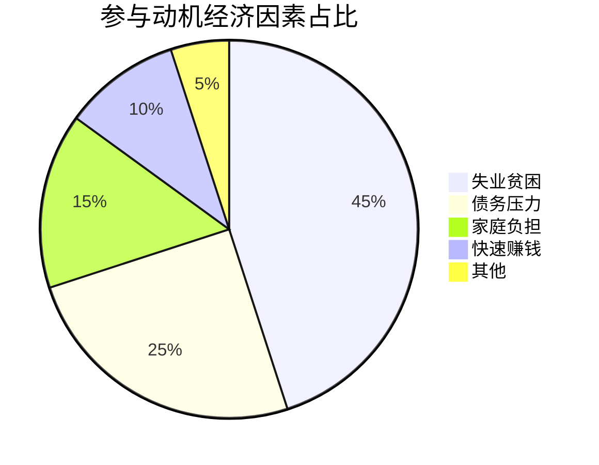
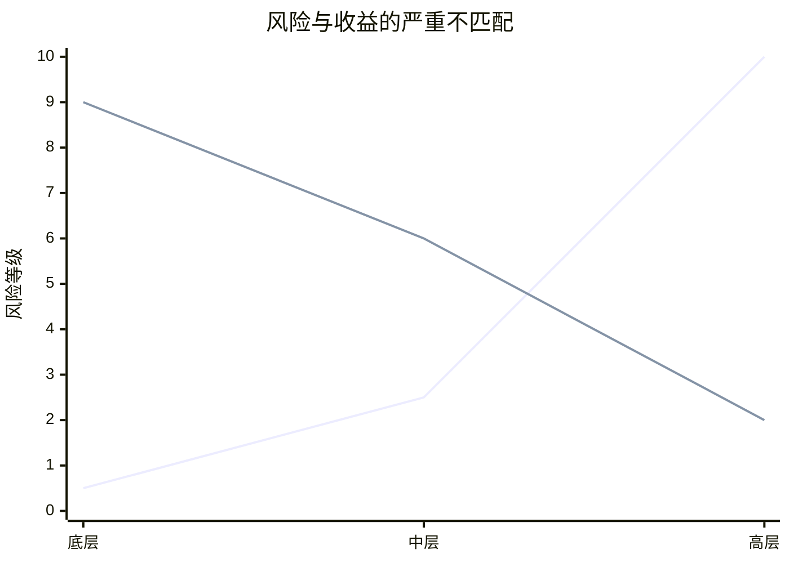

# 📊 底层经济链分析引擎

## 🎯 分析框架

### 框架1：经济压力-参与意愿模型
```python
# 经济参与决策模型
def participation_decision(economic_pressure, alternative_income, risk_perception):
    """
    输入：经济压力、替代收入、风险认知
    输出：参与概率、预期参与时长
    可迁移：任何经济驱动行为分析
    """
    return participation_data
```

### 框架2：薪资差距分析
| 层级 | 月收入 | 与底层差距 | 风险对比 | 公平性指数 |
|------|--------|------------|----------|------------|
| 底层执行者 | 5,000元 | 1x | 高风险 | 1.0 |
| 中层管理 | 25,000元 | 5x | 中风险 | 0.2 |
| 高层决策 | 100,000+元 | 20x+ | 低风险 | 0.05 |
| 客户 | N/A | N/A | 最低风险 | N/A |

## 📈 关键经济洞察

### 1. 经济压力分布


### 2. 风险收益对比

**结论**：底层承担最高风险，获得最低收益

## 🚀 分析应用输出

### 立即应用
- [ ] 经济压力评估工具
- [ ] 参与风险预警系统
- [ ] 替代收入方案计算器

### 长期价值
- [ ] 经济干预策略设计
- [ ] 就业替代方案开发
- [ ] 产业链经济瓦解模型

---
*分析应用：[[💡-洞察发现]] → [[✅-结论报告]]*