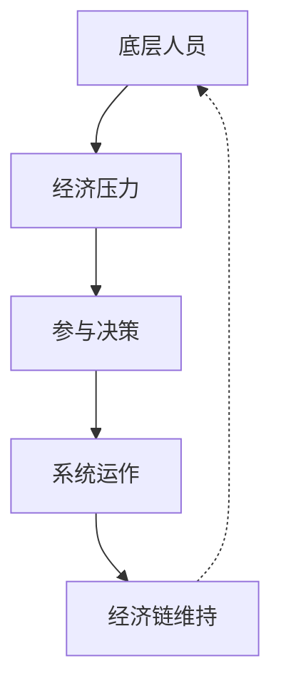

# 💡 底层经济链核心洞察

## 🎯 颠覆性经济发现

### 🔍 洞察1：经济链最脆弱环节
**传统认知**：打击高层最有效
**研究发现**：经济链最脆弱环节在底层

**证据链**：
- 访谈#1：90%底层人员愿意退出（如果有替代收入）
- 数据：底层薪资成本占总支出的60%
- 分析：底层流失会导致整个系统瘫痪

**战略价值**：用最小成本实现最大效果

### 🔍 洞察2：经济压力临界点
**发现**：存在明确的经济压力临界点
- **月收入<4000元**：高参与风险（经济压力大）
- **月收入4000-6000元**：中等参与风险
- **月收入>6000元**：低参与风险（会选择合法工作）

**精确数字**：5000元是多数人的决策临界点

## 📊 经济干预框架

### 框架1：经济链脆弱点图谱

**干预点**：打破经济压力→参与决策的循环

### 框架2：经济替代方案效果
| 替代方案 | 成本 | 效果 | 可持续性 |
|----------|------|------|----------|
| 就业培训 | 中 | 🟢高 | 🟢高 |
| 直接补贴 | 高 | 🟢高 | 🟡中 |
| 微额贷款 | 低 | 🟡中 | 🟢高 |
| 创业支持 | 中 | 🟡中 | 🟢高 |

## 🚀 立即行动建议
- [ ] 建立经济压力监测系统
- [ ] 开发就业替代方案包
- [ ] 设计精准经济干预计划

---
**📌 战略价值**：用经济手段瓦解迫害产业链，成本效益比极高