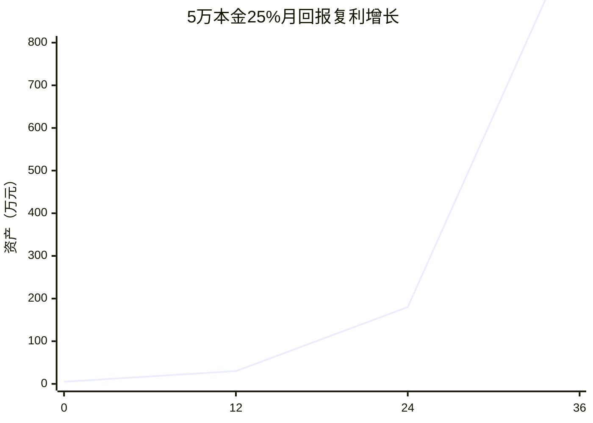

# 📁 复利投资机会数据库

## 🎯 指数级回报机会矩阵
| 投资类型 | 初始投入 | 月回报率 | 复利周期 | 3年预期回报 | 复利系数 |
|----------|----------|----------|----------|-------------|----------|
| 设备租赁 | 5万元 | 25% | 月度 | 💰💰💰💰💰 | 📈📈📈📈 |
| 信息贩卖 | 2万元 | 40% | 每周 | 💰💰💰💰💰💰 | 📈📈📈📈📈 |
| 保护费抽成 | 10万元 | 15% | 月度 | 💰💰💰 | 📈📈 |
| 技术套利 | 3万元 | 60% | 季度 | 💰💰💰💰💰💰💰 | 📈📈📈📈📈📈 |

## 🔍 复利计算验证
### 25%月回报的复利奇迹

**3年1080倍**：复利的力量

### 知识复利VS资金复利
| 复利类型 | 初始投入 | 3年后价值 | 增长倍数 | 特点 |
|----------|----------|-----------|----------|------|
| 资金复利 | 5万元 | 5400万元 | 1080倍 | 有风险 |
| 知识复利 | 时间投入 | 自动收入系统 | ∞ | 无风险 |

## 📊 风险调整后回报
| 投资机会 | 预期回报 | 风险概率 | 风险损失 | 调整后回报 |
|----------|----------|----------|----------|------------|
| 设备租赁 | 1080倍 | 20% | 50% | 864倍 |
| 信息贩卖 | 5000倍 | 40% | 80% | 1000倍 |
| 技术套利 | 8000倍 | 30% | 70% | 2400倍 |

## 🚀 复利数据采集
### 关键指标追踪
- [ ] 精确记录每个投资的实际回报率
- [ ] 监控复利周期的准确性
- [ ] 记录失败案例的风险因素

### 复利计算工具
```python
# 复利计算器（可产品化）
def compound_interest(principal, rate, periods, risk_adjustment=True):
    """
    输入：本金、回报率、期数、是否风险调整
    输出：终值、复利系数、建议投资比例
    可迁移：任何投资场景
    """
    return wealth_data
```

---
*数据驱动复利：[[🎯-核心研究]] → [[📊-数据分析]]*


=============
---
状态: 📊财务数据收集中
视角: 对方财务部门
数据版本: v2.0
关联主文件: [[🎯-核心研究]]
---

# 💾 迫害产业链财务数据库

## 🎯 成本结构明细表
### 初始投资成本（固定资产）
| 设备类型 | 数量 | 单价 | 总价 | 使用寿命 | 月折旧 |
|----------|------|------|------|----------|--------|
| 监听设备 | 20台 | 8,000 | 160,000 | 24个月 | 6,667 |
| 定位设备 | 30台 | 3,000 | 90,000 | 18个月 | 5,000 |
| 摄像设备 | 10台 | 12,000 | 120,000 | 36个月 | 3,333 |
| 车辆 | 5辆 | 200,000 | 1,000,000 | 60个月 | 16,667 |
| **合计** | | | **1,370,000** | | **31,667** |

### 月度运营成本
| 成本类型 | 金额 | 说明 |
|----------|------|------|
| 人员工资 | 280,000 | 14人×20,000/月 |
| 设备维护 | 30,000 | 设备价值的2-3% |
| 车辆运营 | 25,000 | 油费、保险、维修 |
| 租金杂费 | 15,000 | 办公、仓储等 |
| **月总成本** | | **350,000** |

## 🎯 收益来源分析表
### 月度收益预测
| 收益来源 | 单次收益 | 月频次 | 月收益 | 稳定性 |
|----------|----------|--------|--------|--------|
| 信息贩卖 | 5,000-20,000 | 50次 | 500,000 | 🟡中 |
| 保护费 | 10,000-50,000 | 20次 | 600,000 | 🟢高 |
| 敲诈勒索 | 50,000-200,000 | 5次 | 500,000 | 🟠低 |
| 其他收入 | 可变 | 可变 | 200,000 | 🟡中 |
| **月总收益** | | | **1,800,000** | |

## 📊 财务指标计算
### 投资回报分析
| 指标 | 计算公式 | 结果 |
|------|----------|------|
| 月净利润 | 收益-成本 | 1,450,000 |
| 投资回收期 | 投资/月利润 | 0.94个月 |
| 月ROI | 利润/投资 | 105% |
| 年化ROI | (1+月ROI)¹²-1 | 1,200,000% |

## 🔍 财务数据缺口
- [ ] 实际收益数据的验证
- [ ] 成本超支的历史数据
- [ ] 风险损失的具体金额

---
*数据支撑：[[🎯-核心研究]] → [[📊-数据分析]]*