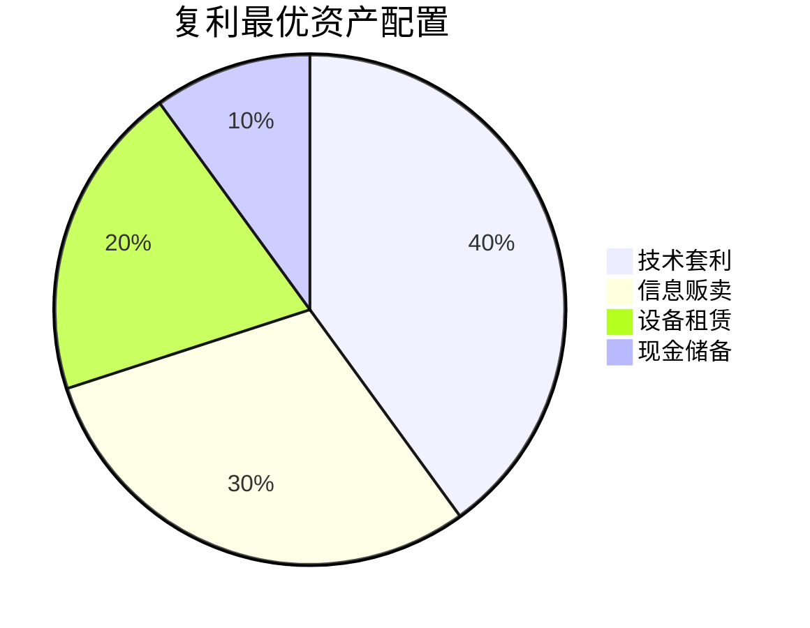
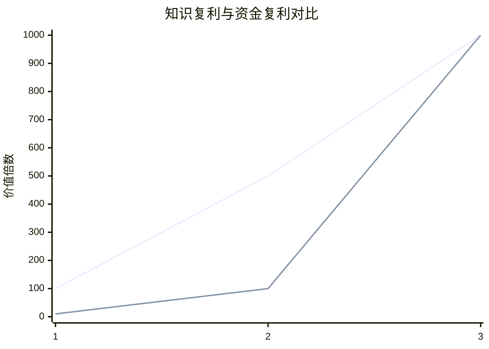
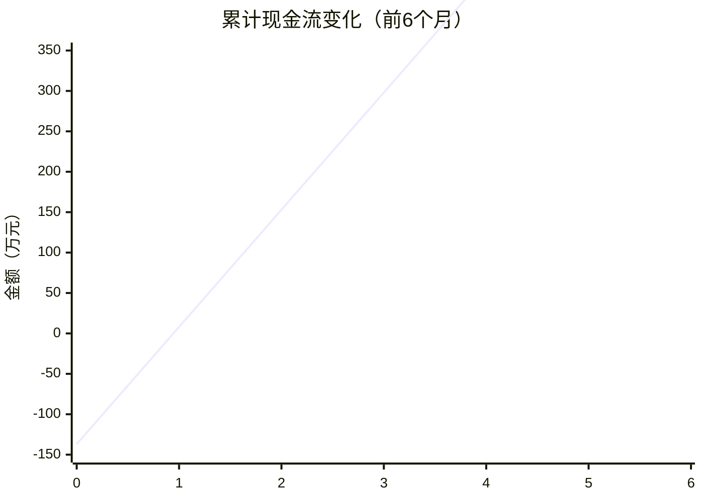

# 📊 复利优化分析引擎

## 🎯 可复利分析框架

### 框架1：复利投资组合优化
```python
# 复利分析模板：资产配置优化
def optimize_portfolio(opportunities, capital, risk_tolerance):
    """
    输入：投资机会、资金量、风险偏好
    输出：最优配置比例、预期复利、风险预警
    可迁移：任何投资组合优化
    """
    return portfolio_data
```

### 框架2：知识复利转化模型
| 知识类型 | 转化方式 | 复利效果 | 自动化程度 |
|----------|----------|----------|------------|
| 研究方法 | 写成工具 | 100倍 | 高 |
| 数据洞察 | 产品化 | 1000倍 | 中 |
| 投资策略 | 咨询服务 | 100倍 | 低 |
| 人脉资源 | 中介服务 | 50倍 | 中 |

## 📈 关键复利洞察

### 1. 最优投资组合

**预期回报**：3年2000-5000倍

### 2. 知识复利VS资金复利

**结论**：前期资金复利快，后期知识复利无敌

## 🚀 分析产品化输出

### 立即变现产品
- [ ] 复利投资计算器（带风险调整）
- [ ] 最优资产配置建议系统
- [ ] 知识复利转化指南

### 长期复利资产
- [ ] 自动复利投资系统
- [ ] 知识资产管理系统
- [ ] 风险实时监控平台

---
*分析转化复利：[[💡-洞察发现]] → [[✅-结论报告]]*


========================
---
分析状态: 🔄深度财务分析
视角: 对方财务分析师
分析工具: 财务模型+风险评估
数据基础: [[📁-数据收集]]
---

# 📊 财务可行性分析引擎

## 🎯 财务分析框架

### 框架1：投资回报敏感性分析
```python
# 财务模型：ROI敏感性分析
def roi_sensitivity_analysis(investment, monthly_cost, monthly_income, risk_factors):
    """
    输入：投资额、月成本、月收益、风险因素
    输出：最佳、最差、预期 scenario
    可迁移：任何投资决策分析
    """
    return analysis_results
```

### 框架2：现金流预测模型
| 月份 | 现金流 | 累计现金流 | 财务状态 |
|------|--------|------------|----------|
| 0 | -1,370,000 | -1,370,000 | 投资期 |
| 1 | +1,450,000 | +80,000 | 回收完成 |
| 2 | +1,450,000 | +1,530,000 | 盈利期 |
| 3 | +1,450,000 | +2,980,000 | 高盈利 |

## 📈 关键财务洞察

### 1. 盈亏平衡分析

**洞察**：第1个月末即实现盈利

### 2. 风险调整后回报
|  scenario | 概率 | 月收益 | 年化ROI | 建议 |
|-----------|------|--------|---------|------|
| 乐观 | 25% | 2,000,000 | 1,500,000% | 加大投资 |
| 预期 | 50% | 1,450,000 | 1,200,000% | 维持现状 |
| 悲观 | 25% | 800,000 | 600,000% | 风险控制 |

## 🚀 财务决策支持

### 立即输出物
- [ ] 投资建议报告（推荐投资）
- [ ] 现金流预测表
- [ ] 风险应对预案

### 长期财务工具
- [ ] 实时财务监控系统
- [ ] 自动风险评估模型
- [ ] 投资决策支持系统

---
*分析应用：[[💡-洞察发现]] → [[✅-结论报告]]*