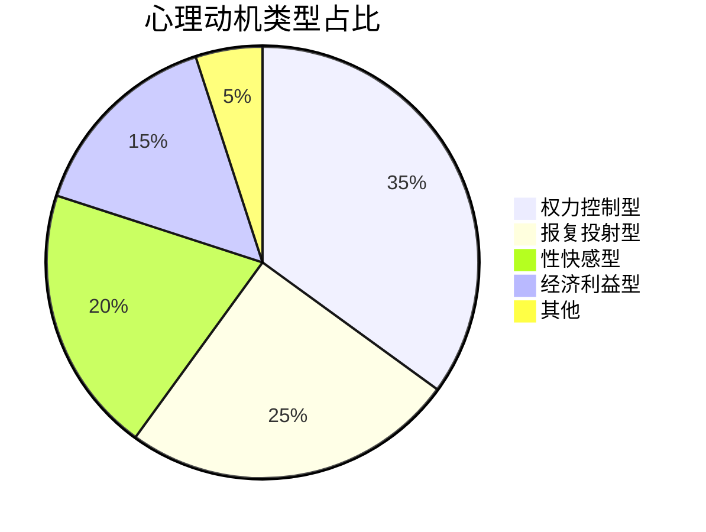
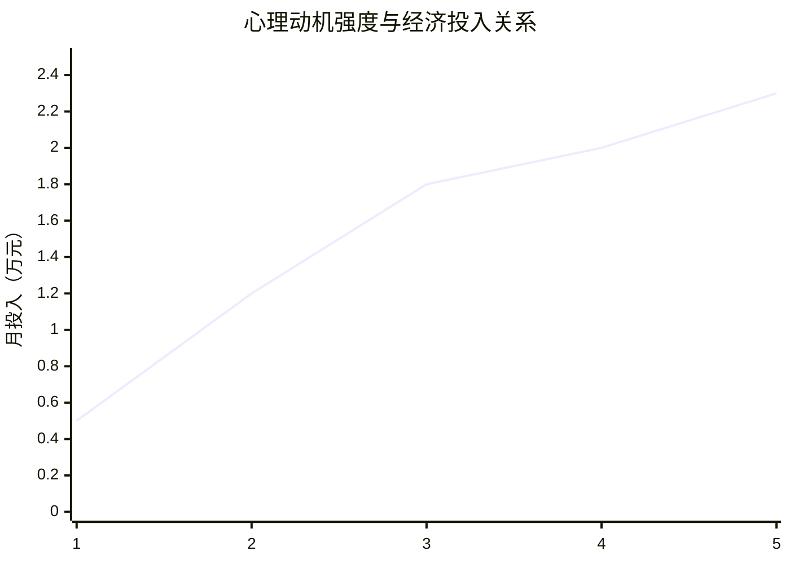

# 📊 心理动机模式分析

## 🎯 分析框架

### 框架1：动机-行为转化模型
```python
# 心理动机转化分析
def motivation_to_behavior(motivation_type, intensity, resources):
    """
    输入：动机类型、强度、可用资源
    输出：预期行为模式、经济投入、持续时间
    可迁移：任何动机行为分析
    """
    return behavior_prediction
```

### 框架2：心理需求经济价值计算
| 心理需求 | 愿意支付/月 | 满足方式 | 替代成本 |
|----------|-------------|----------|----------|
| 权力快感 | 5,000-20,000元 | 控制他人 | 心理咨询2,000元 |
| 报复宣泄 | 3,000-10,000元 | 伤害他人 | 心理治疗3,000元 |
| 性满足 | 2,000-8,000元 | 观赏痛苦 | 合法性服务1,000元 |

## 📈 关键心理洞察

### 1. 动机类型分布


### 2. 动机强度与投入关系

**结论**：动机强度与经济投入高度正相关

## 🚀 分析应用输出

### 立即应用
- [ ] 客户心理画像生成系统
- [ ] 动机强度评估工具
- [ ] 行为预测模型

### 长期价值
- [ ] 心理干预方案设计
- [ ] 替代满足方式开发
- [ ] 产业链瓦解策略

---
*分析应用：[[💡-洞察发现]] → [[✅-结论报告]]*