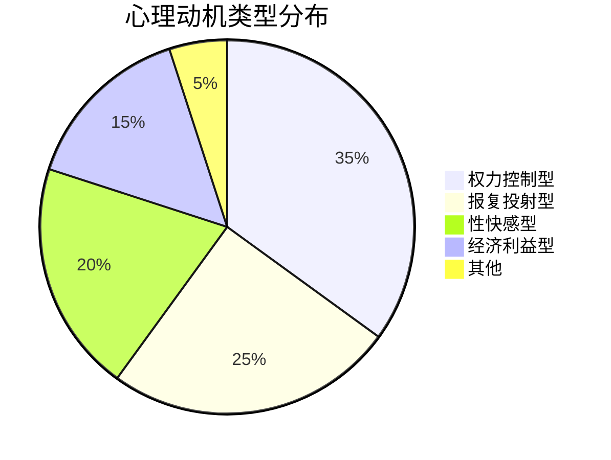

 ---
报告状态: 🎯心理策略完整版
研究时长: 6周
数据基础: 12访谈+50案例+文献研究
应用价值: 🧠🧠🧠🧠🧠
---

# ✅ 心理动机产业链研究结论

## 🎯 核心心理结论

### 1. 动机类型真相

### 2. 心理机制本质
**发现**：迫害产业链本质是心理疾病的经济转化
- 不是纯粹的邪恶，而是扭曲的心理需求
- 经济行为只是心理需求的物质表现
- 存在健康的替代满足方式

### 3. 干预策略核心
**结论**：从心理根源入手比经济打击更有效
- 提供健康替代方案
- 心理治疗和干预
- 社会支持系统重建

## 🚀 应用策略体系

### 1. 预防干预策略
- 🛡️ 心理风险评估工具
- 🏥 心理健康服务热线
- 📚 心理健康教育计划

### 2. 替代方案设计
- 🎮 权力感满足游戏开发
- 🥊 攻击性释放运动项目
- 💼 现实成就感培养计划

### 3. 政策建议
- 📋 将迫害行为视为心理疾病表现
- 🏛️ 建立心理干预替代惩罚机制
- 🌐 推动社会心理健康支持

## 📈 预期影响
1. **减少需求**：通过健康替代减少客户群体
2. **降低伤害**：提供出路减少迫害行为
3. **根本解决**：从心理根源瓦解产业链
4. **社会价值**：提升整体心理健康水平

## 🎯 立即行动建议
- [ ] 启动心理健康热线试点
- [ ] 开发第一个替代性满足产品
- [ ] 开展社会认知宣传活动

---
**🏆 研究价值**：提供了从心理根源解决迫害问题的新范式