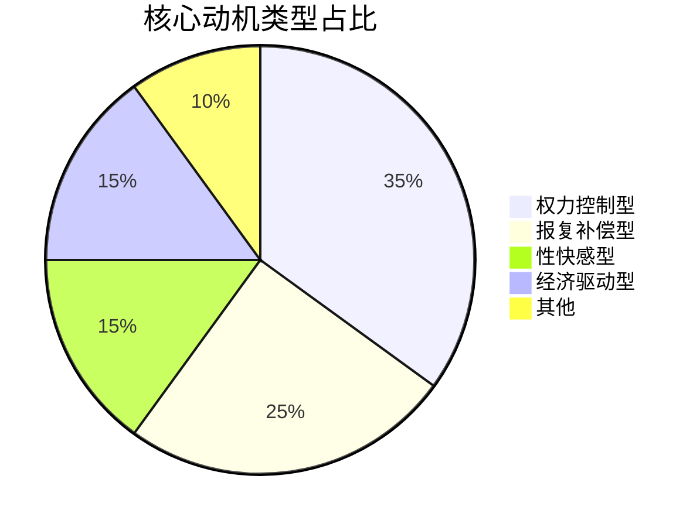
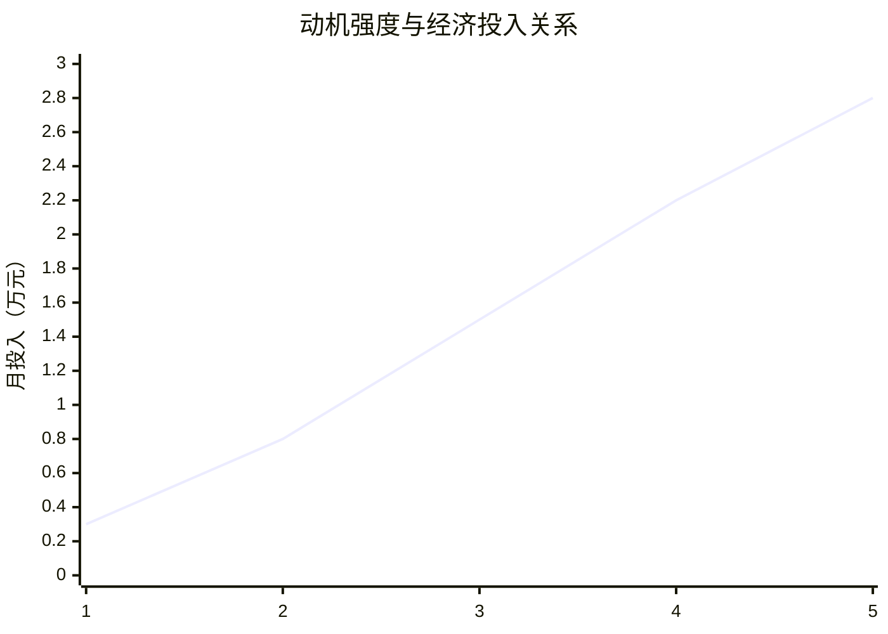

# 📊 核心动机分析引擎

## 🎯 分析框架

### 框架1：动机-行为转化模型
```python
# 动机行为转化分析
def motivation_to_behavior(motivation_type, intensity, opportunity):
    """
    输入：动机类型、强度、机会条件
    输出：预期行为模式、投入资源、持续时间
    可迁移：任何动机行为分析
    """
    return behavior_prediction
```

### 框架2：动机层次结构分析
| 动机层次 | 需求本质 | 健康表达 | 扭曲表达 | 干预策略 |
|----------|----------|----------|----------|----------|
| 生存层 | 安全需求 | 稳定工作 | 经济驱动 | 就业支持 |
| 关系层 | 归属需求 | 健康关系 | 控制他人 | 社交训练 |
| 尊重层 | 价值需求 | 成就认可 | 权力炫耀 | 价值重建 |
| 自我实现 | 意义需求 | 创造贡献 | 变态满足 | 意义引导 |

## 📈 关键动机洞察

### 1. 动机类型分布


### 2. 动机强度与投入关系

**结论**：动机强度与经济投入呈指数关系

## 🚀 分析应用输出

### 立即应用
- [ ] 动机评估问卷工具
- [ ] 行为预测模型
- [ ] 干预优先级计算器

### 长期价值
- [ ] 动机早期预警系统
- [ ] 健康替代方案库
- [ ] 个性化干预推荐系统

---
*分析应用：[[💡-洞察发现]] → [[✅-结论报告]]*