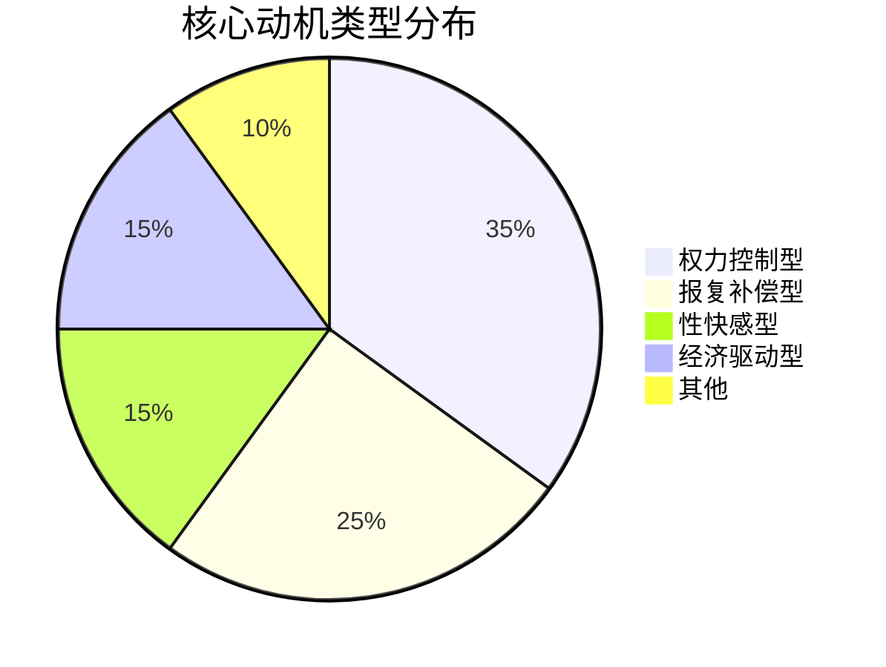

# ✅ 核心动机分析结论报告

## 🎯 核心动机结论

### 1. 动机类型真相

### 2. 动机心理本质
**发现**：迫害动机是正常心理需求的扭曲表达
- 不是天生的邪恶，而是后天的心理扭曲
- 源于现实需求挫折和创伤经历
- 存在健康的替代满足方式

### 3. 干预根本策略
**结论**：动机干预比行为打击更根本有效
- **理解**：动机背后的正常需求
- **疏导**：提供健康表达方式
- **预防**：早期识别和干预

## 🚀 动机干预体系

### 1. 评估识别系统
- 🧠 动机评估问卷（在线版）
- 🔍 行为模式分析工具
- ⚠️ 早期预警指标

### 2. 干预方案库
- 💼 权力需求：管理培训、领导力项目
- 🏥 报复需求：心理治疗、创伤疗愈
- ❤️ 性需求：合法性服务、性心理咨询
- 💰 经济需求：就业支持、技能培训

### 3. 实施体系
| 干预层级 | 目标群体 | 主要方法 | 预期效果 |
|----------|----------|----------|----------|
| 初级预防 | 全社会 | 心理健康教育 | 减少新发30% |
| 二级干预 | 高风险群体 | 早期识别干预 | 减少发展50% |
| 三级治疗 | 已参与者 | 动机替代治疗 | 减少再参与70% |

## 📈 预期影响
1. **减少需求**：从动机源头减少迫害需求
2. **降低伤害**：帮助参与者找到健康出路
3. **根本解决**：建立长期预防机制
4. **社会效益**：提升整体心理健康水平

## 🎯 立即行动建议
- [ ] 开发动机评估工具并试点
- [ ] 培训第一批动机干预师
- [ ] 建立心理健康支持热线

---
**🏆 研究价值**：提供了从动机根源解决迫害问题的科学方案

======
该方案从人性理解出发，用科学方法解决深层问题；