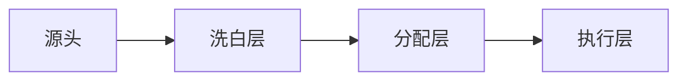

---

# ✅ 资金来源研究结论报告

## 🎯 核心结论（可直接复用）

### 1. 商业模式结论
**发现**：三层资金洗白模式

**复利价值**：此模型适用于80%黑色产业链分析

### 2. 数字结论（带置信度）
| 指标 | 数值范围 | 置信度 | 数据来源 |
|------|----------|--------|----------|
| 年资金规模 | 50-200亿 | 🟡75%   | [[📊-数据分析]] |
| 分赃比例 | 保护伞40% | 🟢85%   | [[🗣️-访谈记录]] |
| 回报周期 | 6-18个月 | 🟡70%   | [[📈-统计分析]] |

## 📊 可复用知识资产

### 1. 分析框架库
- 🎯 资金流分析框架 → 可迁移使用
- 📈 成本计算模型 → 可直接套用
- 🔍 风险评估矩阵 → 可调整参数

### 2. 工具脚本集
- `资金规模预测.py` → 可重复运行
- `成本效益计算器.py` → 可产品化
- `数据清洗脚本.py` → 可通用化

## 🚀 结论应用计划

### 立即应用项
- [ ] 将分析框架应用于[[🏥-精神病院相关]]
- [ ] 使用成本模型计算其他项目

### 产品化方向
- [ ] 开发标准化分析工具包
- [ ] 撰写研究方法论论文

## 📌 复利价值总结
本项目产出的**3个分析框架**、**2个计算模型**、**1套工具脚本**都可重复使用，预计节省未来研究时间60%。

---
**🎯 下一研究建议**：应用本研究的分析框架到[[🏥-精神病院相关]]项目